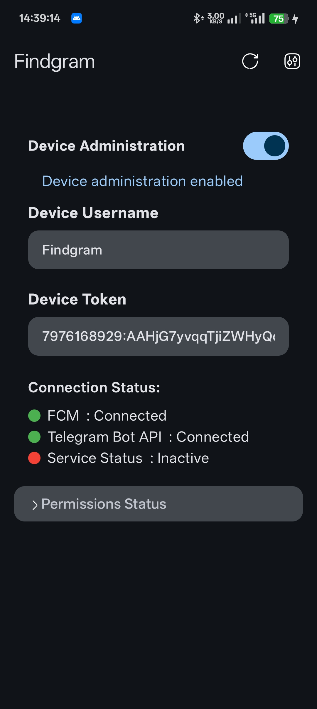
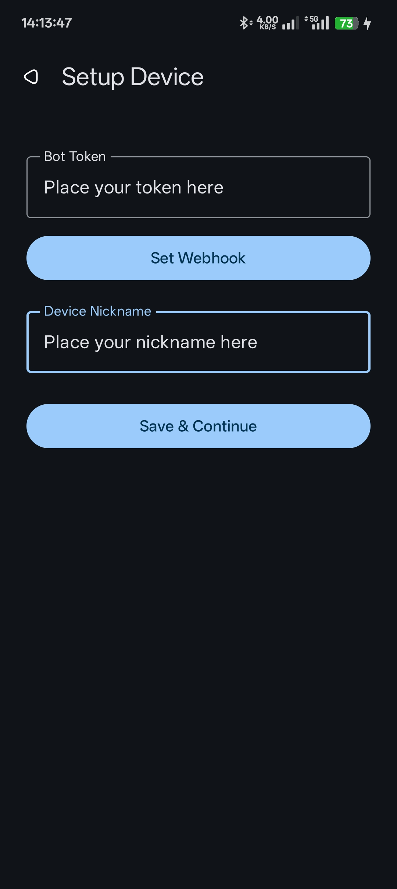
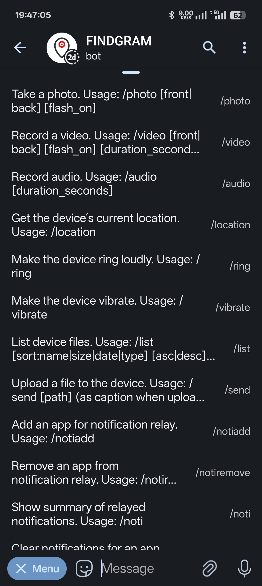

# Findgram

**Findgram** is an advanced Android security and remote control app that enables you to control your device remotely via Telegram bot commands. With Findgram, you can take photos, record videos or audio, fetch your device’s location, ring or vibrate your phone, view and manage files, and relay notifications—all from anywhere in the world using a simple Telegram interface.

## Features of Findgram

- 📸 **Remote Camera Control**: Take photos or record videos (front/rear camera, flash, quality options) with background execution, even when the screen is locked.
- 🎤 **Audio Recording**: Start and receive remote audio recordings.
- 🌍 **Location Tracking**: Get your device's current location as a Google Maps link.
- 🔔 **Notification Relay**: Mirror notifications from selected apps directly to Telegram, with support for viewing, exporting, and clearing notification history.
- 📁 **File Management**: List, download, upload, and delete files on your device via Telegram inline keyboards.
- 🔊 **Ring & Vibrate Remotely**: Make your device ring at max volume or vibrate to help you find it.
- 🔐 **Device Admin Integration**: Support for device admin to prevent unauthorized uninstallation and enable advanced device management.
- ⚡ **Permission & Onboarding UI**: Beautiful Compose UI for setup, permissions, and status monitoring.
- ☁️ **FCM Integration**: Robust background communication using Firebase Cloud Messaging for instant command delivery.
- 🤖 **Easy Telegram Bot Setup**: Securely connect your Telegram bot and device nickname for identification and command routing.

## How It Works

1. **Setup**:  
   - Install the app on your Android device.
   - Create a Telegram bot with the help of Botfather and obtain the token.
   - Complete the in-app setup by placing bot token and device nickname in  Setup Screen.
   - Set the Telegram webhook (in-app button) and set nickanme to save & continue.
   - Then, Open your bot in Telegram and send /register (nickname)
   - Now, you are ready to send commands via Telegram.

2. **Remote Control**:  
   - Send commands to your Telegram bot (e.g., `/photo`, `/video`, `/location`).
   - The app receives the command via FCM, executes the action, and uploads the result (photo, audio, location, etc.) back to Telegram.

3. **Notifications & File Management**:  
   - Receive mirrored notifications from selected apps.
   - Browse, download, and upload files directly through Telegram.

## Screenshots

Below are some screenshots showcasing Findgram's UI and Telegram bot interactions:

  
  
  

## Permissions Required

- **Camera, Audio, and Storage**: For media capture and file access.
- **Location**: To fetch device GPS coordinates.
- **Overlay**: For background operation of camera/video (Android 10+).
- **All Files Access**: For advanced file management (Android 11+).
- **Device Admin**: For uninstall protection.
- **Notification Listener**: To relay notifications from selected apps.
- **Battery Optimization Ignore**: For reliable background operation.

The app UI provides an at-a-glance status for all permissions and helps users grant what's needed easily.

## Security & Privacy

- **No cloud server**: All communication is via FCM and Telegram; no third-party server stores your data.
- **Permission-based**: Only asks for permissions required for features you use.
- **Device admin**: Optional, for advanced security.

## Setup Instructions

1. **Create a Telegram Bot:**  
   Go to [@BotFather](https://t.me/BotFather) on Telegram and create a new bot. Copy the bot token.

2. **Install Findgram:**  
   Download [here](https://github.com/CodexofLost/Findgram/releases) and install on target device.

3. **Configure:**  
   - Open Findgram.
   - Paste your Telegram bot token and set a device nickname.
   - Press "Set Webhook" and "Save & Continue".
   - Grant all required permissions as prompted.
   - Optionally enable Device Admin for extra security.

4. **Start Controlling:**  
   - On Telegram, send commands to your bot (e.g., `/photo`, `/video`, `/location`, etc.).
   - For advanced features, use the inline keyboards sent by the bot.

## Telegram Commands

- `/photo` — Take a photo (front/rear, flash, quality options).
- `/video` — Record a video for a set duration.
- `/audio` — Record audio for a set duration.
- `/location` — Get current device location.
- `/ring` — Make device ring loudly.
- `/vibrate` — Make device vibrate.
- `/list` — List files and folders, download or delete remotely.
- `/send` — Send files to device from Telegram.
- `/notiadd` — Add an app for notification recording.
- `/notiremove` — Remove app from notification recording.
- `/noti` — View currently tracked app notifications.

And more. Custom inline keyboards make navigation intuitive in Telegram.

## Contributions

PRs are welcome! If you want to add features, improve UI, or fix bugs—open an issue or pull request.

## Credits

- Built with Jetpack Compose, Room, Firebase Cloud Messaging, and Telegram Bot API.
- Developed by [CodexofLost](https://github.com/CodexofLost).

## License

MIT License. See [LICENSE](LICENSE) for details.

---

*Findgram: Control your device from anywhere, securely and privately.*
